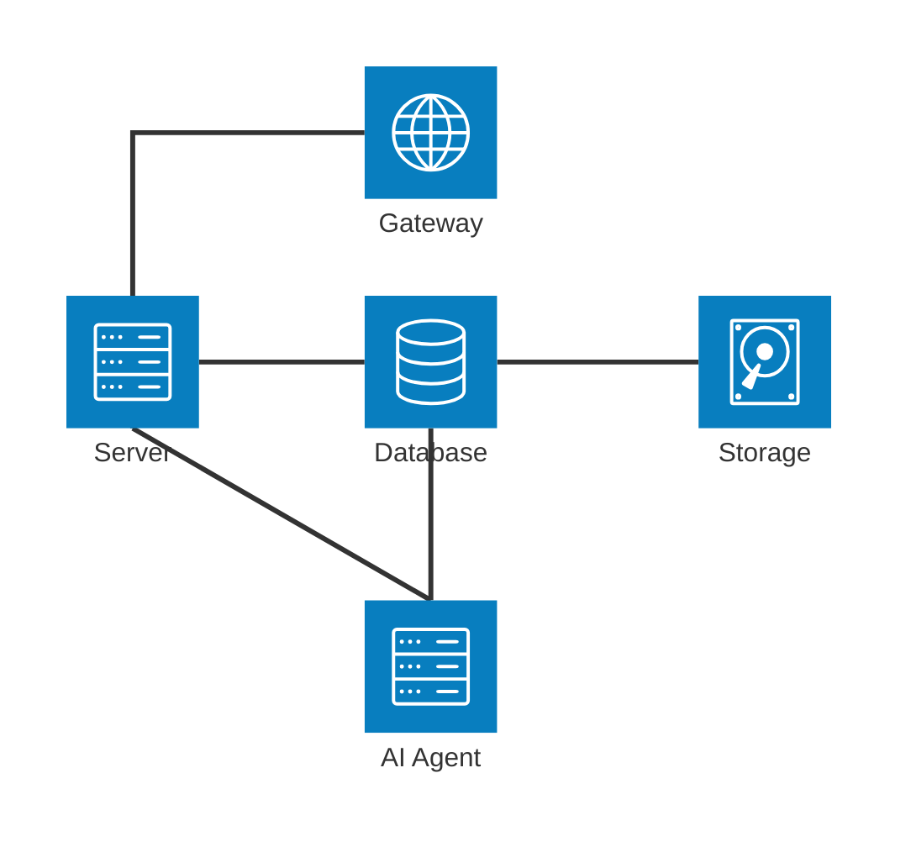
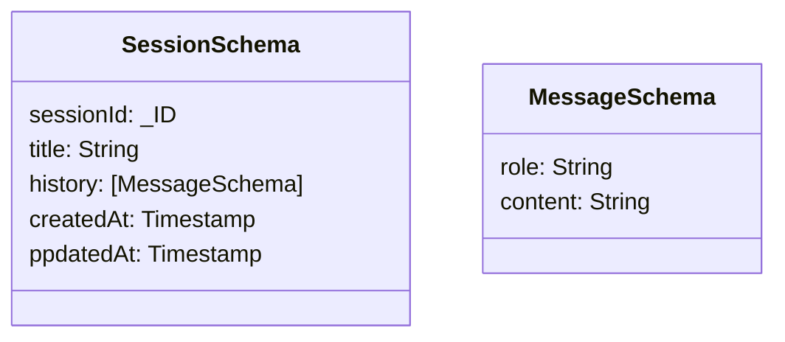
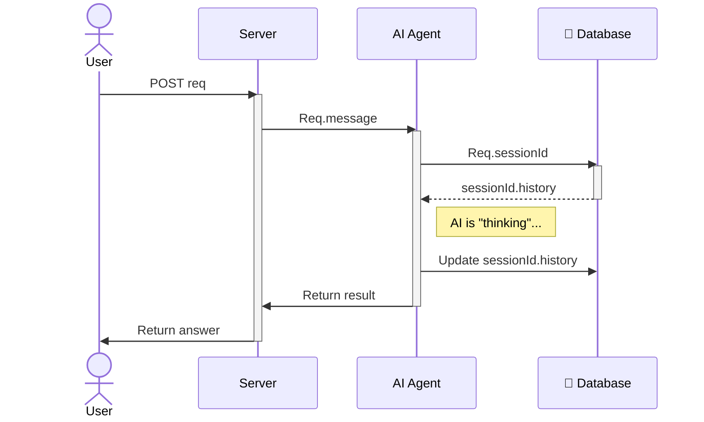

# 🤖 LLM Chat Backend

This project leverages **LangChain** to orchestrate an AI agent powered by **Ollama**, using **MongoDB** for persistent chat memory—all managed within a modern **pnpm monorepo** architecture.

---

## 🛠 Prerequisites

You can run this stack via Docker (recommended) or standalone:

* **Docker & Docker Compose** (Simplest setup)
    
    **OR**

* **Local Deployment**:
  * **Node.js**: v22 or higher
  * **pnpm**: v9 or higher
  * **Ollama**: v0.18.0 or higher
  * **MongoDB**: v8.2.2 or higher

---

## 🚀 Quick Start

### Local Deployment

1.  **Clone the repository:**
    ```bash
    git clone https://github.com/1fedotov/llm-chat-backend.git
    cd llm-chat-backend
    ```

2.  **Configure Environment:**
    Create a `.env` file in the root directory:
    ```bash
    OLLAMA_MODEL=gemma3:270m
    ```

3.  **Launch the Stack:**
    ```bash
    docker compose up --build
    ```
    *Note: This command builds the server, initializes MongoDB, and executes the Ollama entrypoint script to automatically pull the Gemma model.*

---

## 🏗 Architecture

The project is designed as a multi-container stack. In production (Google Cloud Run), these containers operate as sidecars sharing the same network interface.

* **Backend Server**: Node.js (TypeScript) + LangChain orchestration.
* **AI Engine**: Ollama (running `gemma3:270m`).
* **Database**: MongoDB (Persistent chat history storage).

## Database schema


## Session & Message Handling
Messages are embedded within the ```history``` field of the Session document.
The data flow is managed via a custom agent middleware that mimics a **MongoDBSaver**. It functions as a checkpoint system: reading the session history before the LLM call and persisting the updated history immediately after.

## Sequence: ```POST 'chat/:sessionID'```


## Documentation & Deployment
* **API Documentation**: Detailed endpoint info can be found in [API Documentation](./API_README.md)
* **Live Demo**: [Public deployment URL](https://ollama-chat-backend-477781310393.us-central1.run.app)
