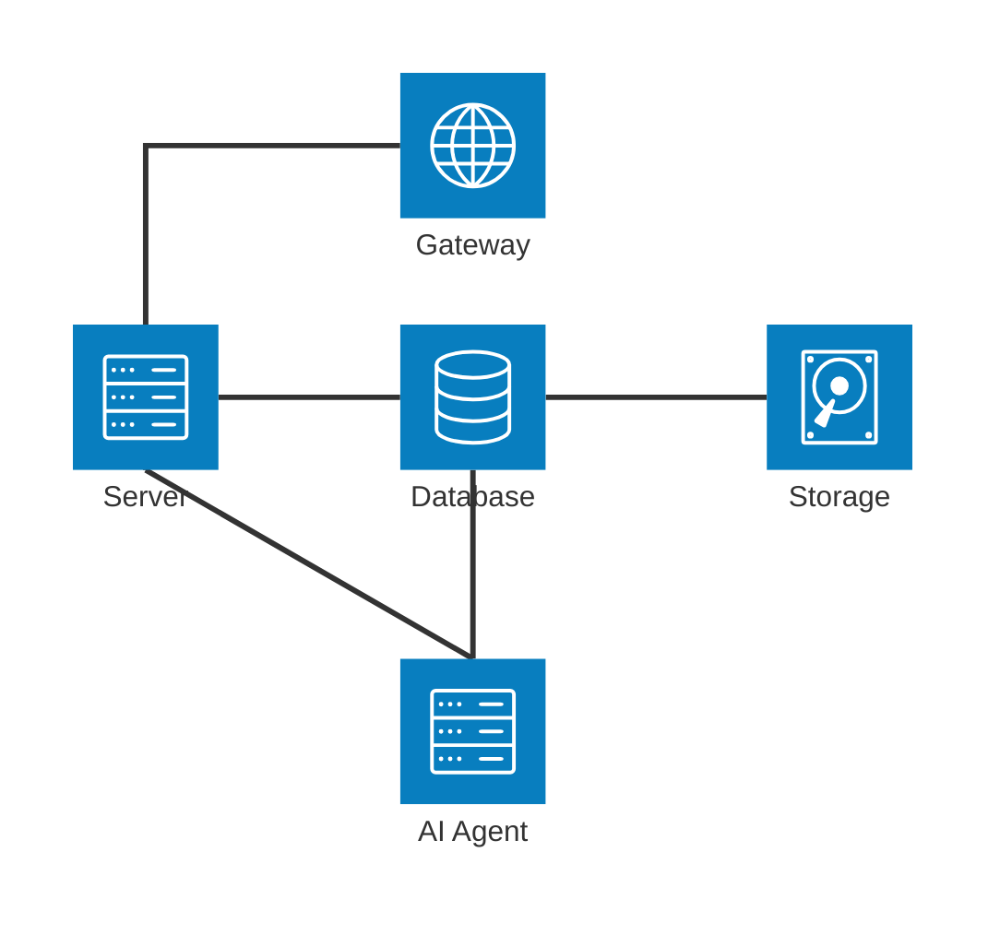
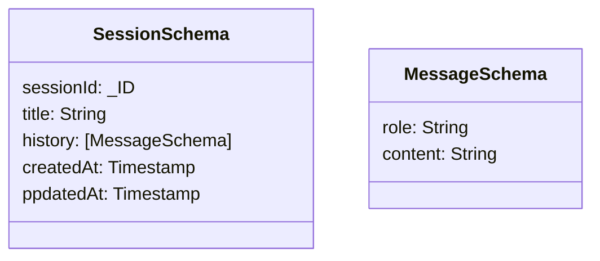
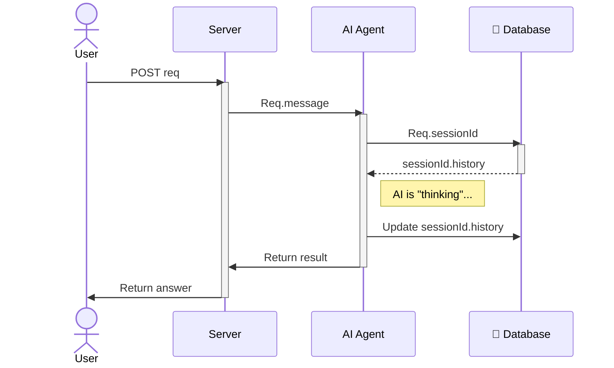

# LLM Chat Backend
his project uses LangChain to orchestrate an AI agent powered by Ollama, with MongoDB for persistent chat memory, all managed within a pnpm monorepo.
## Prerequisites
- Docker & Docker Compose
  OR
- Node.js v22 or higher
- pnpm v9 or higher
- Ollama v0.18.0 or higher
- MongoDB 8.2.2 or higher

## Quick Start
### Local Development
1. **Clone repository:**
```bash
git clone <your-repo-url>
cd <project-folder>
```
2. **Configure Environment:**
Create a ```.env``` file in the root directory:
```
OLLAMA_MODEL=gemma3:270m
```
3. **Launch the Stack:**
```bash
docker compose up --build
```
*This will build the server, start MongoDB, and trigger the Ollama entrypoint script to pull the Gemma model.*

## Architecture Diagram
The project is designed to run as a multi-container stack. In production (Google Cloud Run), these containers run as sidecars sharing the same network interface.
-**Backend Server**: Node.js (TypeScript) + LangChain.
-**AI Engine**: Ollama (running gemma3:270m).
-**Database**: MongoDB (Chat history storage).

## Database schema


## How your data model supports session and message queries


## Link or location of API documentation


## Public deployment URL 


- Feel free to install other dependencies you need.

"devDependencies": {
    "@trivago/prettier-plugin-sort-imports": "^5.2.2", -> A prettier plugin to sort import declarations by provided Regular Expression order.

    "@typescript-eslint/eslint-plugin": "^5.45.0",
    "eslint": "^8.57.1", -> tool for identifying and reporting on patterns found in ECMAScript/JavaScript code.

    "eslint-plugin-import": "2.31.0", -> intends to support linting of ES2015+ (ES6+) import/export syntax, and prevent issues with misspelling of file paths and import names. 

    "eslint-plugin-prettier": "^5.2.1",

    "husky": "^8.0.0", -> Automatically lint your commit messages, code, and run tests upon committing or pushing.

    "lint-staged": "^13.2.2", -> Run tasks like formatters and linters against staged git files and don't let 💩 slip into your code base!

    "prettier": "^3.3.3",

    "syncpack": "^10.0.0", ->  is a command-line tool for consistent dependency versions in large JavaScript Monorepos

    "turbo": "^2.6.1" -> is a high-performance build system for JavaScript and TypeScript codebases. It is designed for scaling monorepos and also makes workflows in single-package workspaces faster, too.
  },
